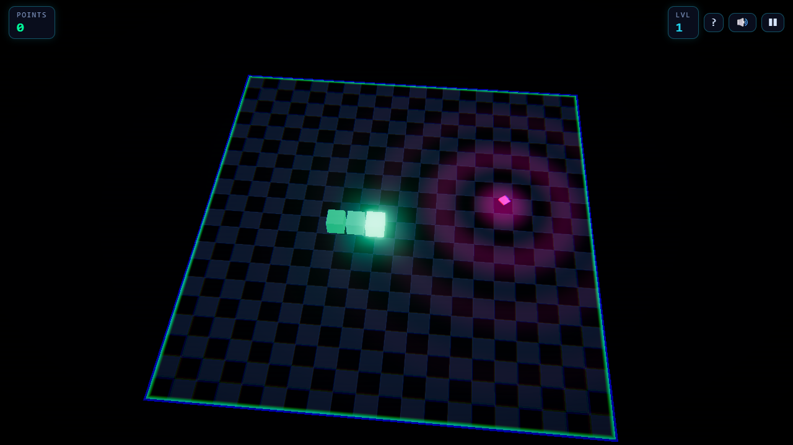

# ISO SNAKE

**v2.1** — a neon isometric 3D snake game in a single HTML file.

Built with [Three.js](https://threejs.org): no build step, no assets, no dependencies to install. Everything (game, shaders, audio, UI) lives in one `index.html`.



## Features

- 🐍 Iridescent snake rendered with a custom shader injected via `onBeforeCompile` (head = one Mesh, body = one `InstancedMesh`: 2 draw calls)
- 🌆 Isometric neon world: animated floor grid, breathing border, purple obstacles, wrap-around borders
- ✨ Arcade post-processing: neon bloom (half-res), chromatic aberration, vignette, CRT scanlines, glitch — all merged into a single FX pass
- 🔊 Fully synthetic audio (WebAudio, no sound files)
- 📱 Touch support: swipe to steer, tap to start; desktop: arrow keys / WASD + orbit camera
- ⚡ Low input latency: instant head feedback on key press, zero-allocation hot paths, adaptive quality on slow devices
- 🎊 Power-ups: 2× points, slow-mo, ghost, shrink — with HUD ring countdown
- 🏆 Levels every 500 points, local high-score saved on your device

## Controls

| Action | Desktop | Touch |
|---|---|---|
| Move | `↑↓←→` / `WASD` | swipe |
| Pause | `P` / `Esc` / ⏸ | — |
| Help | `H` / ? | — |
| Audio | `M` | — |
| Start / confirm | `Enter` / click | tap |
| Orbit camera | drag | — |
| Zoom | scroll wheel | — |

## Download the game

The whole game is a single file — pick whatever suits you:

- **Direct download** (single file, ~55 KB):
  [`index.html`](https://github.com/ciskje/ISOSnake/raw/main/index.html) → save it and double-click it in any modern browser.
- **Whole repository as ZIP**:
  [`archive/refs/heads/main.zip`](https://github.com/ciskje/ISOSnake/archive/refs/heads/main.zip)
- **Git clone**:
  ```bash
  git clone https://github.com/ciskje/ISOSnake.git
  ```
- **Play instantly in the browser** (no download): [https://ciskje.github.io/ISOSnake/](https://ciskje.github.io/ISOSnake/)

> The file loads Three.js from a CDN, so you need an internet connection the first time you open it (everything else is self-contained).

## Run it locally

```bash
# just open the file
start index.html            # Windows
open index.html             # macOS
xdg-open index.html         # Linux

# or serve it
python -m http.server 8000
```

## Repository layout

```
index.html   ← the entire game
AGENTS.md    ← notes/instructions for AI agents working on this repo
README.md    ← this file
LICENSE      ← MIT
```

## Licence

ISO SNAKE is released under the **MIT Licence**. See [`LICENSE`](LICENSE) for details.

Three.js is licensed under its own MIT licence and is loaded from its official CDN.
